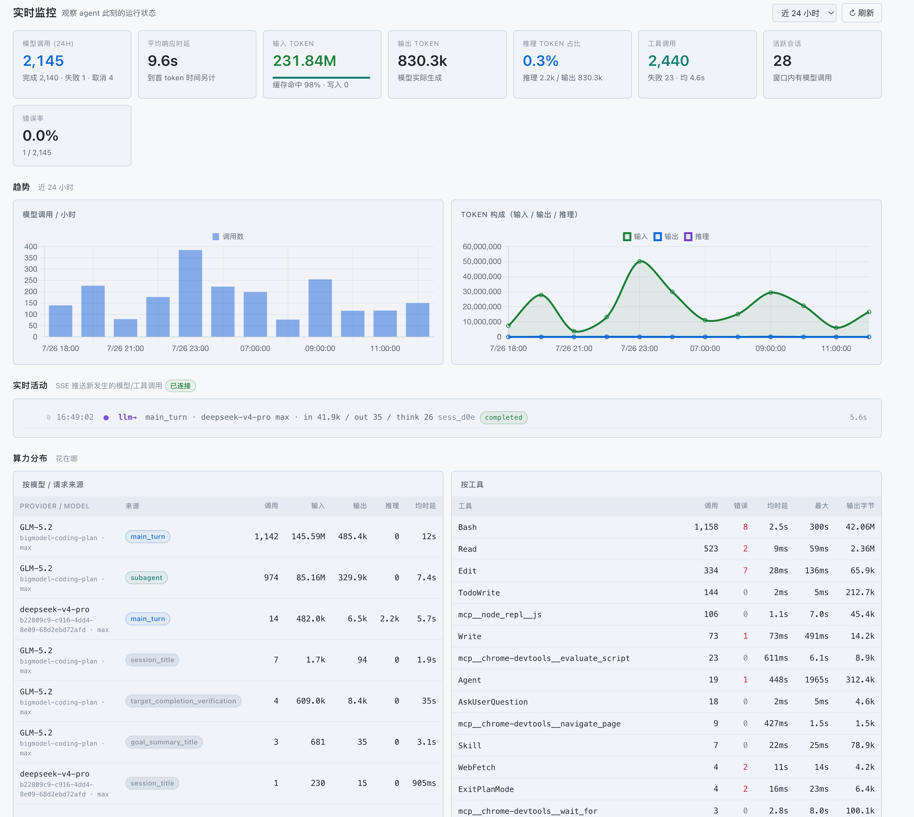
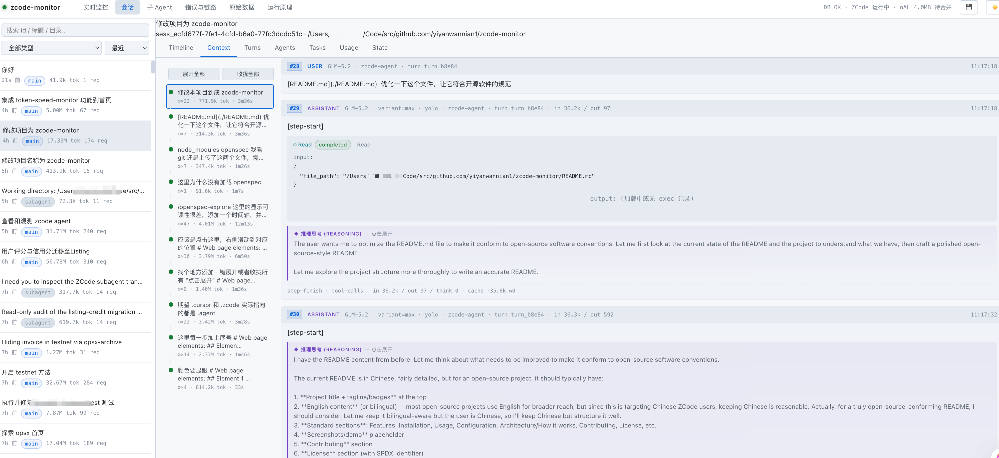

<div align="center">

# zcode-monitor

**本地常驻的 Web 工具，用来实时追踪、调查、理解 ZCode agent 的运行。**

[](https://nodejs.org/)
[](LICENSE)
[](#贡献)

只读访问 `~/.zcode/cli/` 下的 SQLite + JSONL，**无需改动 ZCode 任何东西**。

</div>

---

## 简介

`zcode-monitor` 是一个跑在 `127.0.0.1` 的本地观测面板。它会读取 ZCode 客户端在磁盘上落下的数据（SQLite 主库、`transcript.jsonl` 事件流、日志、Bash 输出），把一次 agent 运行里发生的所有事——模型请求、token 消耗、工具调用、子 agent 派生、推理链——整理成可视、可查、可追溯的界面。

监控读路径全程**只读**，不修改、不删除任何 ZCode 数据，也不和 ZCode 的写事务抢锁（唯一例外是 WAL checkpoint 功能，完整边界见下文「隐私提示」之后的说明）。

视觉对齐 kimi-vis 参考页面：分层暗色背景、分类色编码、左列表 + 右详情（7 标签）。

## 特性

-  **实时监控** —— 模型调用数、token（输入/输出/推理/缓存）、工具调用、错误率、活跃会话；按小时趋势图；按模型 / 请求来源 / 工具的算力分布；SSE 实时推送。
-  **会话深挖** —— 左栏会话列表（搜索 / 筛选 / 排序），右栏 7 个标签：Timeline / Context / Turns / Agents / Tasks / Usage / State。
-  **子 Agent 关系树** —— 从主会话到派生子 agent 的调用树（`parent_id` 级联）。
- ️ **错误与链路** —— 按错误类型 / 工具汇总；失败调用列表；最慢工具 Top 30；输入 `trace_id` 还原事件瀑布图。
-  **推理可视化** —— 思考型模型的推理链单独呈现，与最终回答分开，点击展开。
- ️ **原始数据查看器** —— 直接查任意 SQLite 表（`where` / `order` / 降序，JSON 列可展开）。
-  **双主题** —— Dark（默认）/ Light，三种切换方式。
-  **全程只读** —— 不改 ZCode 一行数据。

## 快速开始

### 前置要求

- [Node.js](https://nodejs.org/) ≥ 18
- 已安装并至少运行过一次的 ZCode 客户端（用于生成 `~/.zcode/cli/` 下的数据）

### 安装与运行

```bash
git clone <your-repo-url> zcode-monitor
cd zcode-monitor
npm install          # 装 express + better-sqlite3
npm start            # 启动服务并自动打开浏览器
```

浏览器会自动打开 `http://127.0.0.1:7331/`。`Ctrl-C` 停止。

### 开发模式

```bash
npm run dev          # node --watch，文件改动自动重启
```

## 配置

通过环境变量配置，均有默认值：

| 变量         | 默认值                         | 说明                   |
|------------|-----------------------------|----------------------|
| `PORT`     | `7331`                      | 监听端口                 |
| `HOST`     | `127.0.0.1`                 | 监听地址（出于安全默认只绑本地）     |
| `ZCODE_DB` | `~/.zcode/cli/db/db.sqlite` | SQLite 主库路径          |
| `OPEN_BROWSER` | `1`（未设即开）          | 启动时是否自动打开浏览器（设 `0` 关闭） |

示例：

```bash
PORT=8000 ZCODE_DB=/path/to/db.sqlite npm start
```

## 它能看什么

### 1. 实时监控 (Overview)

此刻的运行状态：模型调用数、token（输入/输出/推理/缓存）、工具调用、错误率、活跃会话；按小时的趋势图；按模型/请求来源/工具的算力分布；**SSE 实时推送**新发生的模型/工具调用。



### 2. 会话深挖 (Sessions) — 核心

左栏会话列表（搜索/筛选/排序），右栏 7 个标签（下图展示 **Context** 标签：完整对话历史，推理思考用紫色侧边块单独呈现，点击展开看全文）：



- **Timeline** — 事件时间线（子 agent 的 transcript.jsonl 事件流）。
  把 `turn_started → model_request → model_network_status → model_streaming → model_complete → tool.call/result → turn_complete`
  映射成 wire 风格行，按分类色编码。**推理流式输出折叠成 `◆ think` 行**，点击展开。
- **Context** — 完整对话历史（SQLite message+part）。**推理思考(reasoning)用紫色侧边块单独呈现**，与最终回答分开，点击展开看全文。
- **Turns** — 每个 turn 的耗时横条 + token/工具统计。
- **Agents** — 该会话派生的子 agent（profile、token、prompt）。
- **Tasks** — TodoWrite 写入的任务清单。
- **Usage** — 每个 turn 的 token/工具明细表。
- **State** — 会话元数据（cwd、parent、trace_id、时间）。

### 3. 子 Agent 关系树 (Agents)

从主会话到派生子 agent 的调用树（`parent_id` 级联）。点节点跳转该 agent 会话。

### 4. 错误与链路 (Errors)

按错误类型/工具汇总；失败调用列表（点击带入 `trace_id`）；最慢工具 Top 30；**输入 `trace_id` 还原日志事件瀑布图**。

### 5. 原始数据 (Raw)

直接查任意 SQLite 表（`session`/`message`/`part`/`model_usage`/`tool_usage`/`turn_usage`/`todo`...），支持 `where`/`order`/降序，JSON 列可展开。调试用。

### 6. 运行原理 (How It Works)

用**你自己机器上的真实数据**解释 ZCode 怎么工作：数据模型 ER 图、`turn → request → tool` 的完整流程、推理（reasoning）机制、上下文压缩、prompt 缓存。

## 数据源

全部只读：

| 来源             | 路径                                                      | 用途                            |
|----------------|---------------------------------------------------------|-------------------------------|
| SQLite 主库      | `~/.zcode/cli/db/db.sqlite`                             | 会话/消息/模型调用/工具调用/turn 汇总（权威数据） |
| transcript 事件流 | `~/.zcode/cli/agents/<parent>/agent_*/transcript.jsonl` | 子 agent 的实时事件流（Timeline 标签）   |
| 子 agent 元数据    | 同目录 `metadata.json`                                     | profile、prompt、token、派生关系     |
| 每日日志           | `~/.zcode/cli/log/zcode-YYYY-MM-DD.jsonl`               | `trace_id` 还原事件瀑布             |
| Bash 输出        | `~/.zcode/cli/exec/<sess>/<callId>-stdout.log`          | 工具调用的 stdout/stderr           |

关联键：

- `turn_id` 串起一个回合
- `trace_id` 贯穿整棵请求树
- `tool_call_id` 连接工具调用 ↔ 输出 ↔ 事件

## 隐私提示

有第三方报告称 ZCode 可能会在后台上传工作区快照到云端（涉及本机 `~/.zcode/v2/checkpoints/` 目录）。
**该说法为第三方报告，未经我们验证**，本项目不下断言、也不复现该行为，仅汇总公开来源供参考：

- 第三方项目：Masterchiefm/zcode-speed-panel 的「快照防护」说明（早期版本曾引 HumanAILoop/zemote 的「停更声明」，经核实全网查无此项目，已弃用该来源——与 docs/specs/ecosystem-adoption-v1.md WP5 的裁定一致）
- 社区报道：Hacker News「Zcode silent workspace snapshot upload」讨论串、知乎文章《智谱ZCode，你打包上传我的代码仓库干什么》、开源中国 2026-09 相关报道

如需自查，可在 Windows 上以只读方式列出该目录（只列目录，不做任何改动）：

- PowerShell：`Get-ChildItem "$env:USERPROFILE\.zcode\v2\checkpoints"`
- Git Bash：`ls ~/.zcode/v2/checkpoints`

目录存在与否都属于正常的自查结果：目录存在仅说明本机生成了快照数据，不足以据此推断云端行为。

监控读路径对 `~/.zcode/` 全程只读。唯一例外是 WAL checkpoint 功能（ZCode 退出后自动折叠，或经 `/api/checkpoint` 手动触发）：它以短时可写连接执行 `wal_checkpoint(TRUNCATE)`，只把 WAL 日志折叠进主库、清空 `-wal` 文件，不改变任何数据行内容。

## 故障排查

### 启动后页面一直显示"检查 ZCode 是否在运行" / health 报 `ok:false`

`better-sqlite3` 是原生模块，必须针对你**当前**的 Node 版本编译。如果换了 Node 版本（比如从 18 升到 22/24），会因 `NODE_MODULE_VERSION` 不匹配而加载失败、服务静默崩溃。修复：

```bash
npm rebuild better-sqlite3   # 用当前 node 重新编译原生模块
```

> 报错信息形如 `was compiled against a different Node.js version using NODE_MODULE_VERSION 108` 就是这个问题。

### 查询偶发失败 / 提示"数据库繁忙"

ZCode 用 SQLite 内嵌库（WAL 模式）并持续写入，读时会和它的写事务/checkpoint 抢锁。本工具已做四层加固，正常情况下你会感知不到：

1. **打开层**：连接失败自动重试 5 次（指数退避），不在首次锁竞争时崩溃。
2. **并发层**：`busy_timeout=5000ms` 让 SQLite 等 ZCode 写完而非立即抛 `SQLITE_BUSY`，并以只读连接参与 WAL 共享锁。
3. **查询层**：每条 `prepare().all/get` 自动重试 4 次；连接损坏（CORRUPT/IOERR）时自动重连。
4. **接口层**：锁竞争转成 HTTP `503 retryable`，前端 `getJSON` 自动指数退避重试（300ms → 600ms → 1200ms），不再弹错误卡。

顶栏状态点：绿 = DB 可读、红 = DB 暂不可读（通常几秒内自愈）。如果持续红色，多半是上面那个 Node 版本问题，或 DB 路径不对。

## 主题切换

支持 **Dark（默认）** 和 **Light** 两套主题，三种切换方式：

- 顶栏右侧的 **🌙 / ☀️ 按钮** 点击切换
- 键盘快捷键 **`t`** 切换（输入框内不触发）
- URL 参数 **`?theme=light`** 或 **`?theme=dark`**（会记住选择，如 `http://127.0.0.1:7331/?theme=light`）

选择会存到 `localStorage`，下次打开自动恢复。切换主题时图表颜色会跟随重渲染。主题在页面加载前通过内联脚本应用，避免闪烁（FOUC）。

## 技术栈

- **后端**：Node 18 + Express + better-sqlite3（只读连接，`readonly: true`）
- **前端**：原生 HTML/CSS/JS（无框架、无构建步骤）+ Chart.js (CDN)
- **实时**：Server-Sent Events（SSE）推送新 `model_usage`/`tool_usage` 行
- 全程只读，只监听 `127.0.0.1`，不修改 / 删除任何 ZCode 数据

## 项目结构

```
zcode-monitor/
├── package.json
├── server/
│   ├── index.js              # 入口：Express + 自动开浏览器
│   ├── db.js                 # 只读 DB 连接 + 查询函数
│   ├── zcode-runtime.js      # ZCode 运行状态探测 + WAL checkpoint
│   ├── transcript.js         # 解析 transcript.jsonl + metadata.json
│   ├── log-tail.js           # 日志读取 + trace 还原
│   └── routes/
│       ├── overview.js       # 实时监控
│       ├── sessions.js       # 会话列表 + 详情 7 端点
│       ├── transcript.js     # 事件时间线
│       ├── trace.js          # 错误 + trace 瀑布
│       ├── live.js           # SSE 实时推送
│       ├── agents.js         # 子 agent 树
│       └── raw.js            # 原始表查看器
├── public/
│   ├── index.html            # 单页 shell
│   ├── app.js                # 路由 + 辅助函数
│   ├── styles.css            # 暗色主题（对齐参考页配色 token）
│   └── views/                # 各标签渲染逻辑
│       ├── overview.js
│       ├── sessions.js       # 7 标签
│       ├── timeline.js       # 事件时间线（含 reasoning 折叠）
│       ├── agents.js
│       ├── errors.js
│       ├── raw.js
│       └── how.js            # 运行原理
└── README.md
```

## 开发

无构建步骤，前后端都是原生 JS，改完即生效（开发用 `npm run dev` 自动重启）。

```bash
npm install
npm run dev
```

前端入口 `public/index.html` + `public/app.js`；后端入口 `server/index.js`。各路由按文件拆分在 `server/routes/`。

## 贡献

欢迎提 Issue 和 PR。

1. Fork 本仓库
2. 新建分支：`git checkout -b feat/your-feature`
3. 提交：`git commit -m 'feat: add your feature'`（建议遵循 [Conventional Commits](https://www.conventionalcommits.org/)）
4. 推送：`git push origin feat/your-feature`
5. 提交 Pull Request

请确保：

- 不引入新的原生依赖（除非必要）
- 保持全程只读，不修改 ZCode 数据
- 前端不引入框架 / 构建步骤

## 许可证

[MIT](LICENSE)
